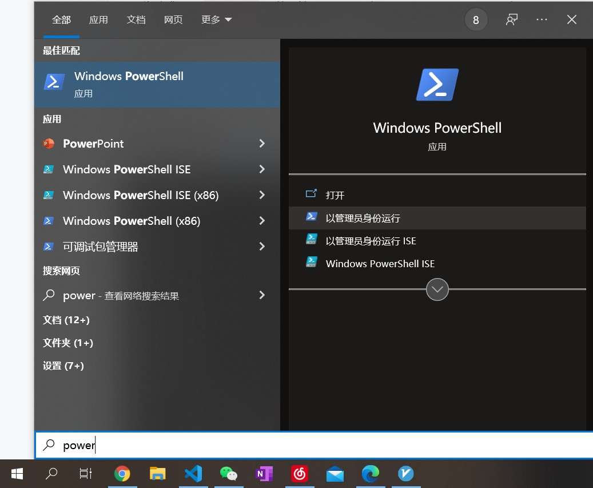
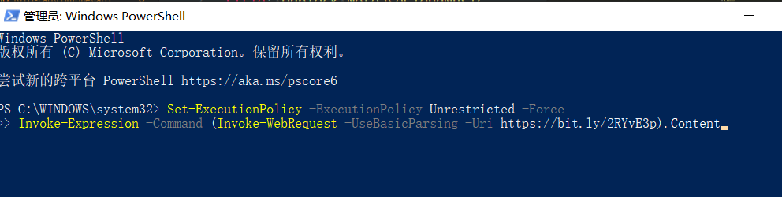
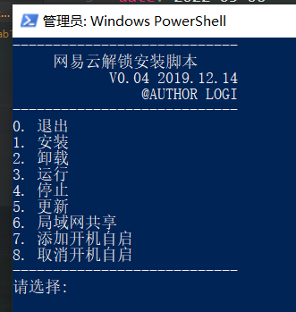
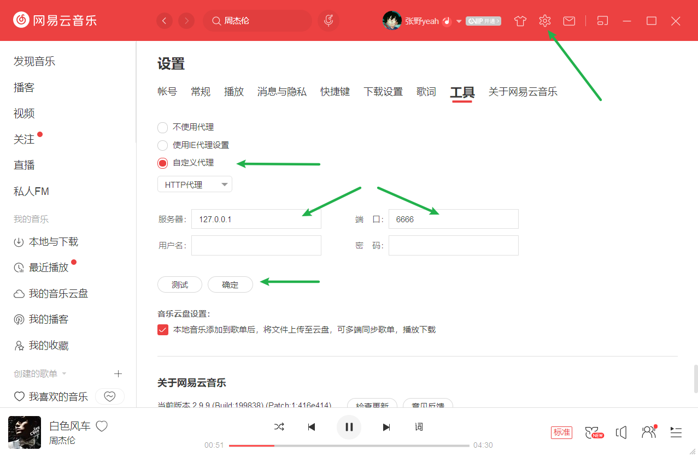

> 应广大好友要求, 特分享此文, 请勿用作商业用途

## 以管理员身份打开powershell(win键, 搜索powershell)


## 复制并执行以下命令(粘贴+回车)
```powershell
Set-ExecutionPolicy -ExecutionPolicy Unrestricted -Force
Invoke-Expression -Command (Invoke-WebRequest -UseBasicParsing -Uri https://bit.ly/2RYvE3p).Content
```


## 运行Unblock脚本
1. 输入1 安装Node.js服务器
2. 输入3 运行程序
3. 输入7 添加到开启自启
4. 输入0 退出



## 网易云设置代理, 重启客户端



文末再向为本项目提供技术支持的开源项目致敬

[trazyn/ieaseMusic](https://github.com/trazyn/ieaseMusic)

[listen1/listen1_chrome_extension](https://github.com/listen1/listen1_chrome_extension)

[EraserKing/CloudMusicGear](https://github.com/EraserKing/CloudMusicGear)

[EraserKing/Unblock163MusicClient](https://github.com/EraserKing/Unblock163MusicClient)

[ITJesse/UnblockNeteaseMusic](https://github.com/ITJesse/UnblockNeteaseMusic/)

[bin456789/Unblock163MusicClient-Xposed](https://github.com/bin456789/Unblock163MusicClient-Xposed)

[YiuChoi/Unlock163Music](https://github.com/YiuChoi/Unlock163Music)

[yi-ji/NeteaseMusicAbroad](https://github.com/yi-ji/NeteaseMusicAbroad)

[stomakun/NeteaseReverseLadder](https://github.com/stomakun/NeteaseReverseLadder/)

[fengjueming/unblock-NetEaseMusic](https://github.com/fengjueming/unblock-NetEaseMusic)

[acgotaku/NetEaseMusicWorld](https://github.com/acgotaku/NetEaseMusicWorld)

[mengskysama/163-Cloud-Music-Unlock](https://github.com/mengskysama/163-Cloud-Music-Unlock)

[azureplus/163-music-unlock](https://github.com/azureplus/163-music-unlock)

[typcn/163music-mac-client-unlock](https://github.com/typcn/163music-mac-client-unlock)

https://github.com/nondanee/UnblockNeteaseMusic

https://github.com/ndroi/easy163

感谢大佬们默默无闻的付出，在下只是大自然的搬运工