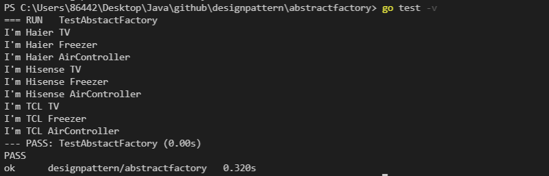

## 实验结果



## 测试命令

`cd abstractfactory && go test -v`

## 环境要求

`go1.13+`

## 接口设计

### 工厂接口

```go
type IFactory interface {
	produceTV() ITV
	produceFreezer() IFreezer
	produceAirController() IAirController
}
```

### 产品接口

- ```go
  type ITV interface {
  	TVSay()
  }
  ```

- ```go
  type IFreezer interface {
  	FreezerSay()
  }
  ```

- ```go
  type IAirController interface {
  	AirControllerSay()
  }
  ```

## 接口实现

- 创建`HaierFactory`, `HisenseFactory`,`TCLFactory`共**3**个工厂结构体，每个工厂实现`3`个方法，分别返回对应的产品结构体

- 创建`[工厂名][产品名]`共**9**个产品结构体，每个产品实现对应接口的`say`方法
