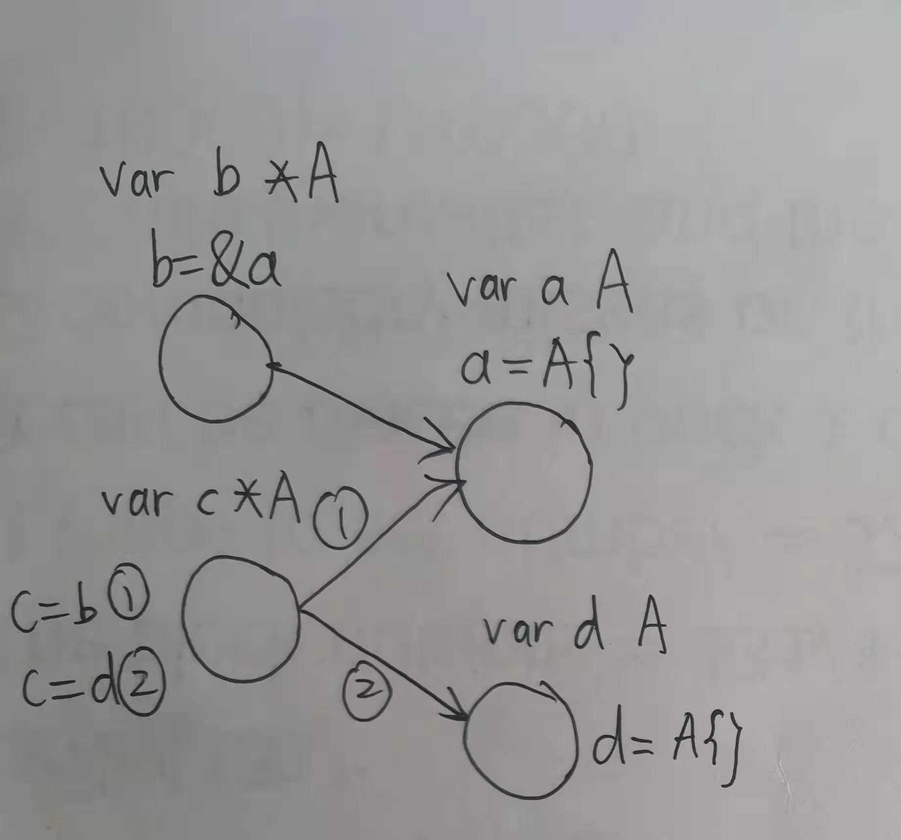
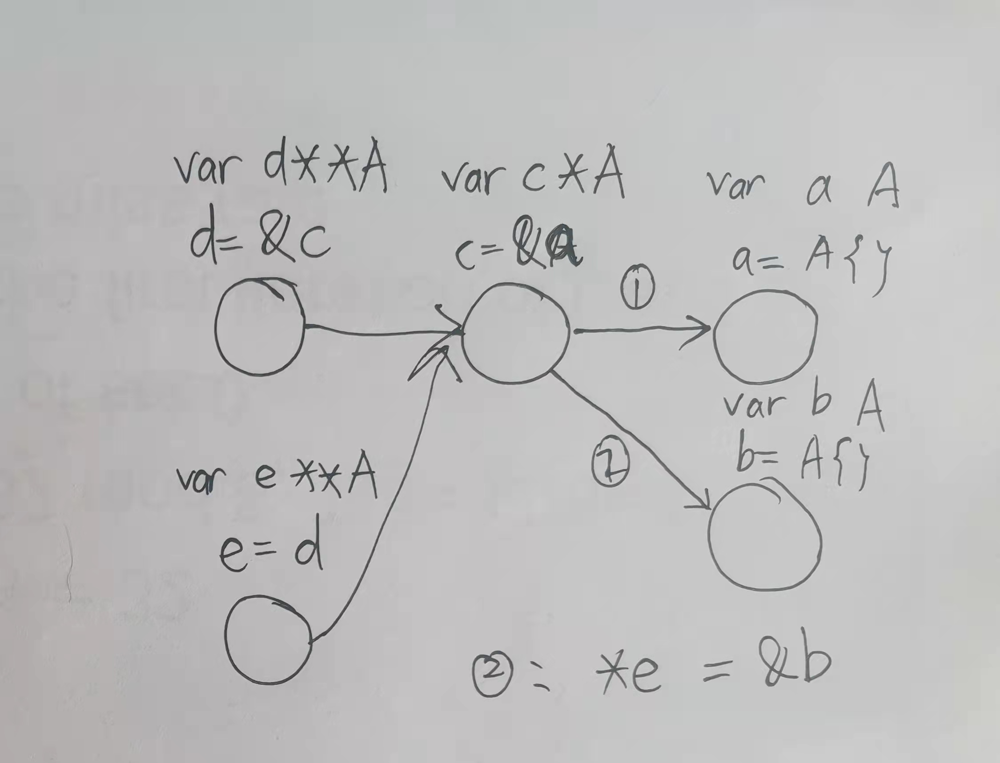

## Golang泛型设计

泛型的本质: `字符串替换`. 就是这么简单粗暴. 解释如下: Golang对于泛型的命名并非普遍的`generic` 而是 `Type Parameter`, 这个命名给我们提供了一个非常好的视角, 把类型作为变量来看待, 而变量的内容就是变量类型的字面字符串. 我们在函数定义时出现的类型变量都是形参, 调用时将形参赋值, 成为实际的变量, 所有的类型转化在编译阶段就可以全部完成. 

为什么结构体/泛型不能定义泛型方法?

Golang中泛型函数(`function`)的定义仅限于函数, 而不能是结构体/结构的方法(`method`).
从语言的使用角度来看, 这样的需求是显然的, 但是任何特性都是有代价的. 结构体的泛型方法必然需要结构体的实例化, 如果想JIT一样在runtime进行, 将会造成一定的性能损失. 所以`Golang`选择不实现, 而是希望能在用户层通过 function的办法替换.从这点来讲, Golang并没有把饭嚼碎喂到嘴边.

参考链接: 

[Type Parameters Proposal](https://go.googlesource.com/proposal/+/refs/heads/master/design/3651-type-parameters.md#no-parameterized-methods)

[proposal: spec: allow type parameters in methods #49085](https://github.com/golang/go/issues/49085)

## 多级指针与图描述的映射-理清指针的终极解决方案## golang 泛型设计

1. 直观的图描述
   - 一个变量对应一个节点
   - 指针变量与被指向变量之间用一条线连接

2. 指针操作与图的映射
   - 左侧指针,右侧取地址`&` 左侧变量的节点指向&符后的变量节点, 实例见图: `c = &a`
   - 左侧指针,右侧指针`=` 左侧变量节点指向右侧变量节点指向的节点, 例: `e = d`
   - 指针取内容`*` 指针变量取地址的表达式等价于它所指向的节点, 例: `*d == c`
3. 空指针
   - 指针变量在初始化后不能使用*, 必须赋值后才可使用, 此时a == nil 为真.

1. 注意事项
   - 关注变量类型
   - 节点只能修改后继节点的值而无法修改兄弟节点的指向
   - golang中的接口可理解为

> 如果你能熟练运用3条操作,恭喜你解锁了多层指针的黑魔法. 从此, 程序猿之间的隔阂将被打破(物理级), 所以, 奔涌吧, 多层指针!

# 常见的坑

1. 切片作形参

众所周知, 切片作为一种引用类型, 在作为形参传递后修改切片的值会修改原切片数据的. 那么请思考以下的程序, 请预测输出的结果.

```go
func main(){
    arr := make([]int, 0)
    foo(arr)
    //输出是什么?
    println(arr)
}

func foo(arr []int){
    arr = append(arr, 1)
}
```

下面公布答案: `[]`, 长度仍然为0, 为什么会这样呢? 不是说好可以修改数据吗.
答案藏在slice 底层的结构:
```Go
type slice struct {
    array unsafe.Pointer
    len   int
    cap   int
}
```
slice传引用针对的是 指向的仅仅是线性表的数据, 而线性表本身的属性(len, cap)仍然是传值, 
所以append对len, cap的修改不会影响原slice. 你答对了吗? ヽ(ー_ー)ノ
