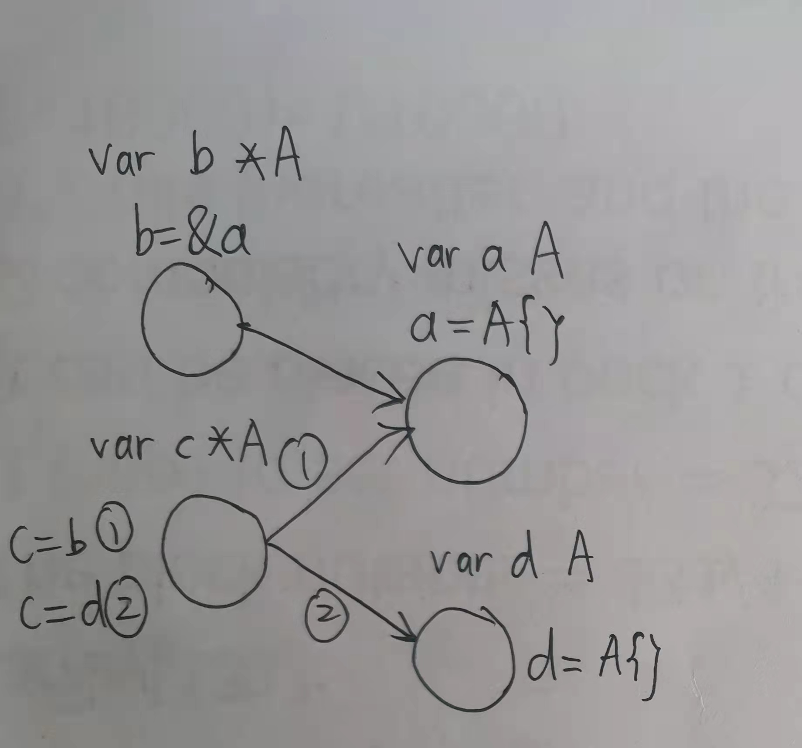
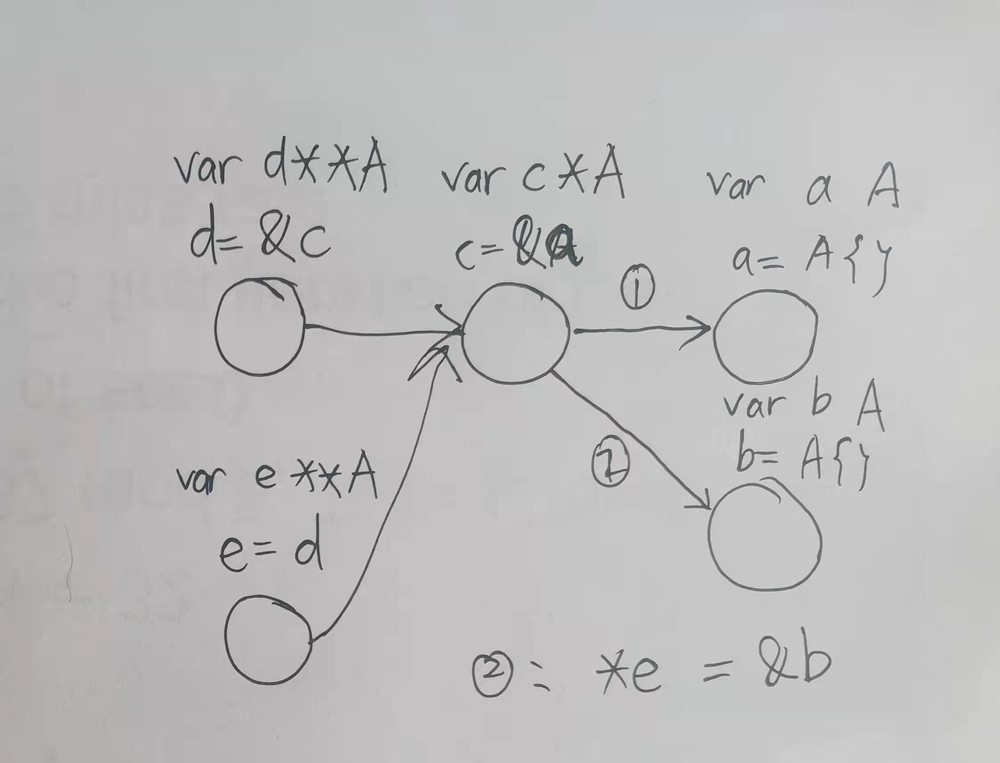

# golang 随笔

## 多级指针与图描述的映射-理清指针的终极解决方案
1. 直观的图描述
   - 一个变量对应一个节点
   - 指针变量与被指向变量之间用一条线连接

2. 指针操作与图的映射
   - 左侧指针,右侧取地址`&` 左侧变量的节点指向&符后的变量节点, 实例见图: `c = &a`
   - 左侧指针,右侧指针`=` 左侧变量节点指向右侧变量节点指向的节点, 例: `e = d`
   - 指针取内容`*` 指针变量取地址的表达式等价于它所指向的节点, 例: `*d == c`

3. 注意事项
   - 关注变量类型
   - 节点只能修改后继节点的值而无法修改兄弟节点的指向
   - golang中的接口可理解为

> 如果你能熟练运用3条操作,恭喜你解锁了多层指针的黑魔法. 从此, 程序猿之间的隔阂将被打破(物理级), 所以, 奔涌吧, 多层指针!

## 空指针