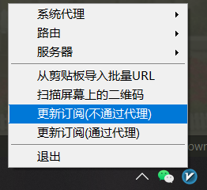
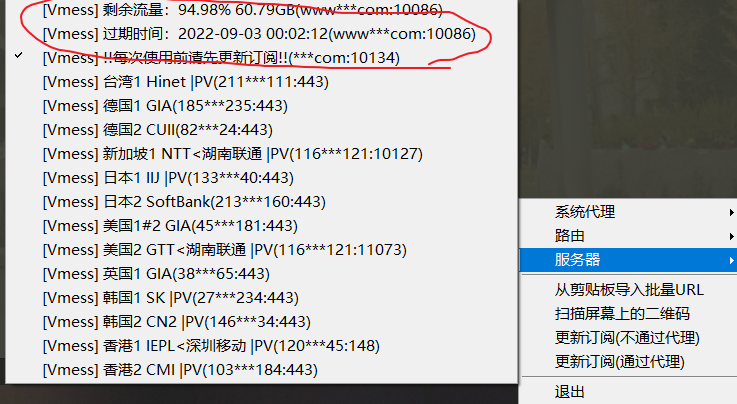
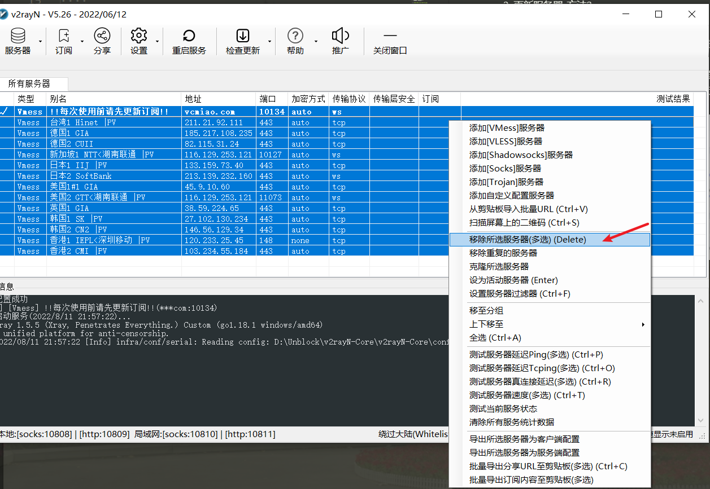
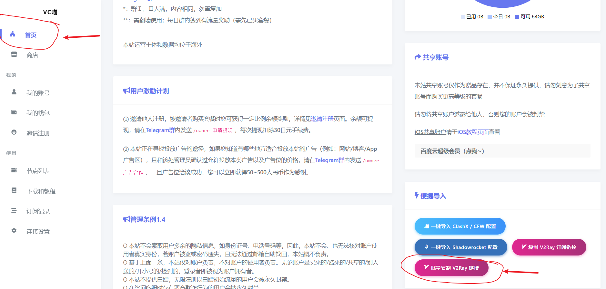
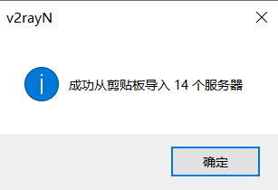
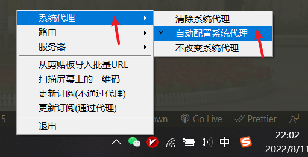
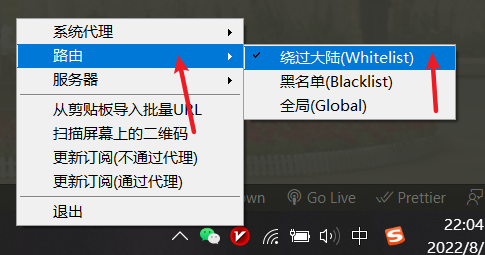
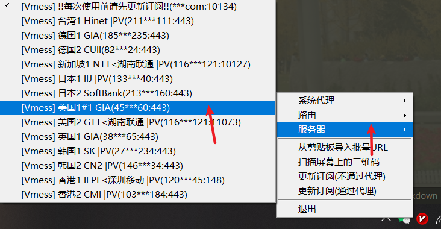

# v2ray客户端使用说明

1. 更新服务器-方法1
    1. 右键点击右下角图标

    

    2. 鼠标左键单击"更新订阅(不通过代理)"
    
    

    3. 10秒后, 查看服务器是否更新

    
    
    4. 如果过期时间仍然未更新, 请查看更新服务器-方法2教程

2. 更新服务器-方法2
    1. 双击右下角图标, 进入主界面
    2. 同时按ctrl+A, 或者按住鼠标左键框选住所有的服务器, 服务器列表将变成蓝色
    3. 按delete键 或者 右键选择"移除所有服务器(多选)"
   
    4. 登录vcmiao.com, 点击首页, 滚轮到网页底端
    5. 左键单击"批量复制V2ray链接"
    
    6. 右键右下角图标, 左键点击"从剪切板导入批量URL". 若成功则会弹出以下界面
   
     
    7. 每次服务器到期/各种原因失效后 都可以都过此方法更新服务器列表.方法1可能会因为种种原因失效, 但方法2肯定有效

3. 启用v2ray服务
    1. 右键右下角图标
    2. 左键选择"系统代理"-"自动配置系统代理". 成功后右下角图标将变成红色
    
    3. 左键选择"路由"-"绕过大陆". 
    
    4. 左键选择"服务器"- 选择可以使用的节点
    
    5. 到此为止就可以访问世界互联网了, 如果仍无法成功访问, 请回退到第4步, 更换不同国家的节点.
