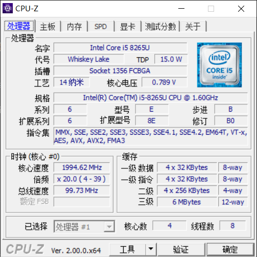
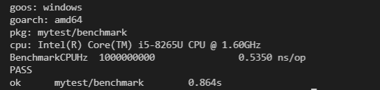
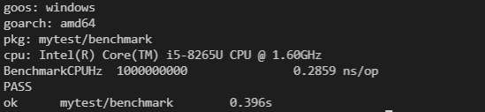
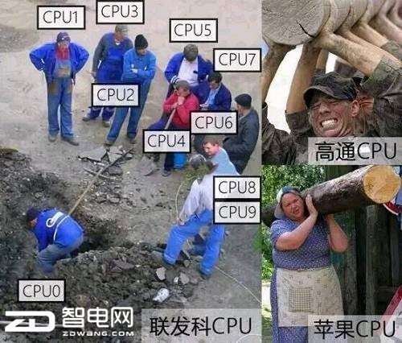
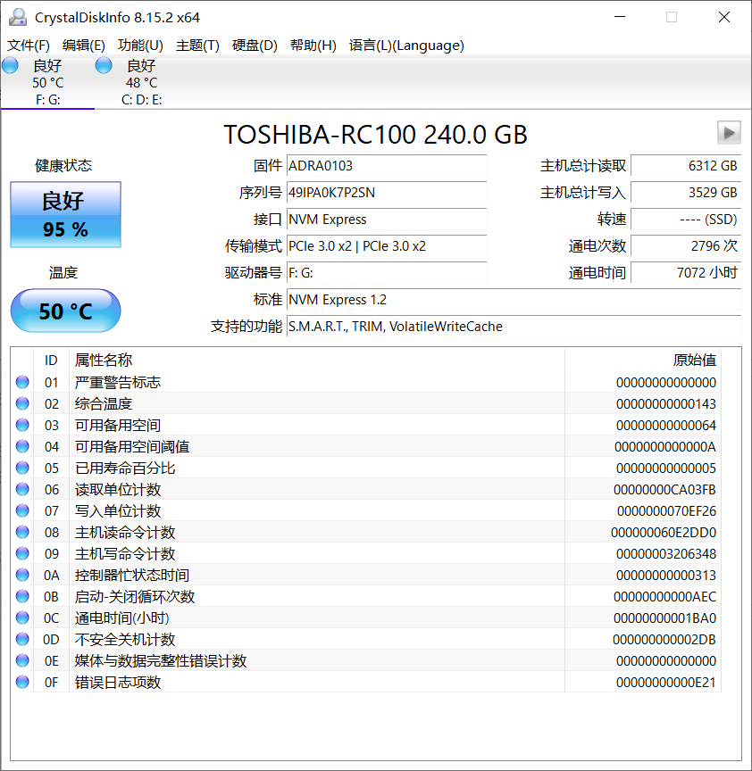
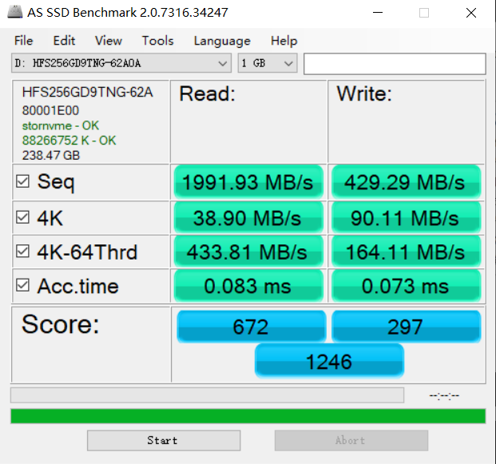
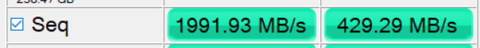

# 计算与存储性能的分析与测试

## 计算-CPU

### 理论分析

#### 评价标准

- **`指令执行速度`**
- `功耗比`

#### 关键参数

- `主频`。CPU 的时钟频率，主频越快，速度越快。计算机的操作在时钟信号的控制下分步执行，每个时钟信号周期完成一步操作。
- `睿频`。CPU 可以稳定运行的上限速率，功耗管理智能调整 CPU 频率，使真实频率高于主频。
- `缓存`。用于减少处理器访问内存所需平均时间的存储器。可分为一级缓存，二级缓存，三级缓存，缓存的结构和大小对 CPU 速度的影响非常大。
- `核心`。“三个臭皮匠顶个诸葛亮”，对于独立的进程，多核心各行其事，但对资源存在竞争的线程，不能发挥 100%的功效。
- `超线程`。CPU 在执行命令时，往往利用内部一个模块，如计算、访问内存等，超线程技术则利用闲置的 CPU 模块执行命令。
- `多路`。服务器 CPU 支持在单台机器多个 CPU。

#### CPU 信息



### 测试实践

#### 测试工具

- `CPU-Z 2.0.0`
- `windows10` 资源管理器
- `go 1.13` -bench 模块

#### 测试过程

- 检查 CPU 基本信息

  

- 利用`go`的`benchmark`模块编写`基准测试`程序

  ```go
  func BenchmarkCPUHz(b *testing.B) {
  	a:=0
  	for i := 0; i < b.N; i++ {
  		a++
  	}
  }
  ```

- `低功耗`条件下测试

  

- 计算 ，实际频率`1.87GHz`为`CPU低功耗`睿频。
- `高功耗`条件下测试

  

- 计算 ，实际频率`3.50GHz`为`CPU高功耗`睿频。

#### 结果分析

- `睿频与功耗`。睿频通常可高于主频 10%-50%，睿频由 CPU 调度，其功耗也会大幅增加，对笔记本电脑而言，接通电源与否对 CPU 性能影响极大。
- `多核`。受限于竞争资源，大部分中小型软件利用率较低。
  
- `超线程`。一般情况下高于单核，由于超线程管理的额外开销，特殊情况反而弱于单核单线程。
- `缓存`。每级缓存命中率约在 80%，可软件层面优化。

## 存储-硬盘

### 理论分析

#### 评价指标

- `读/写速度`
- `容量`

#### 关键参数

- `连续读/写速度`。在磁盘一段连续空间上读写文件的速度，应用场景为传输、备份文件
- `4K 读/写速度`。随机读取不连续 4K 大小的速度，应用场景为软件、游戏运行时加载资源。
- `接口类型`，常见的家用接口有 SATA、M.2，服务器的 SAS。总线速度上限，如下
  |SATA2.0| SATA3.0|PCI-E 3.0|PCI-E 4.0|
  | ---- | ---- | ----| ---- |
  |250MB/s| 600MB/s| 1000MB/s x 带宽| 2000MB/s x 带宽|

#### 硬盘信息



### 测试实践

#### 测试工具

- `AS SSD 2.0.7316`
- `HD-Tune Pro 5.75`
- `Crystal Disk Info 8.15.2`

#### 测试过程

- `读/写`测试
  

#### 结果分析

- `顺序读/写`，读速高达 1991.93MB/s，是机械硬盘理论上限的 3 倍以上。
  
- `4K读/写`，读速 38.90MB/s，写速 90.11MB/s。通常机械硬盘的 4K 读写速度只有个位数，某宝的机械硬盘绝大部分没有此项数据。
  

## 实验心得

- `明确需求`是第一要务。在计算资源丰富的今天，明确自身应用场景，才能不被淹没在各种指标信息的汪洋大海之中。
- `应用场景`
  - `游戏`，选购建议`单核高频`，`固态硬盘`。大部分游戏对多核的优化较差（开发成本高），计算任务集中在单个 CPU 上。游戏在启动和运行时，需要从硬盘读取大量的美术资源和多组小文件。
  - `文件备份,影音娱乐`，选购建议`CPU随意`，`小容量固态+大容量机械`。机械硬盘单位容量价格更低，且保存时间相对于固态更长。固态硬盘在长时间（4~5 年）不通电的情况下，内存电子约束减弱，可能会造成部分文件损坏。如有移动传输需求，机械硬盘在较低高度`坠落`极有可能造成硬盘损坏，固态硬盘由于内部结构不存在机械结构，抗摔能力更强。
  - `专业软件`，选购建议`多核低频`，`固态硬盘`，专业软件多核优化较好，计算能力一定条件下，增加并行核数比提高主频成本更低。
